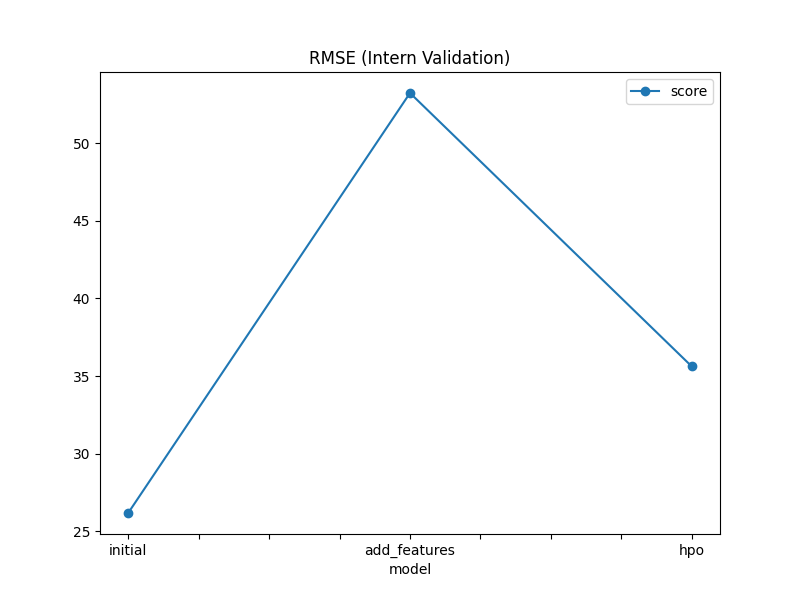
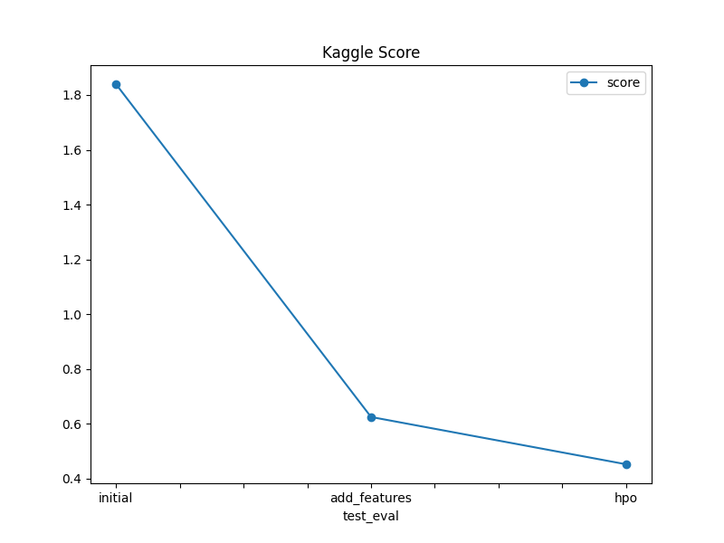

# Report: Predict Bike Sharing Demand with AutoGluon Solution
#### Flora Belas

## Initial Training
### What did you realize when you tried to submit your predictions? What changes were needed to the output of the predictor to submit your results?
AutoGluon generates predictions as a single column named 'prediction', while Kaggle requires a CSV with columns 'datetime' and 'count'. I had to merge the prediction output with the test dataframe’s 'datetime' column and rename the predicted column to 'count' before submission.

### What was the top ranked model that performed?
The top-ranked model after the initial run was WeightedEnsemble_L3, with a validation score of -55.05 RMSE. This model performed the best internally based on AutoGluon's leaderboard.

## Exploratory data analysis and feature creation
### What did the exploratory analysis find and how did you add additional features?
I extracted new features from the 'datetime' column, such as hour, day, month, and year. I also converted categorical-like columns such as 'season', 'holiday', and 'workingday' to categorical types. These additions were meant to give the model temporal context and better generalization.

### How much better did your model preform after adding additional features and why do you think that is?
The best model score improved from -55.05 to -30.42 after adding features. The RMSE decreased significantly, showing that these features helped the model capture important time-based patterns in bike demand — especially hour-of-day and month.

## Hyper parameter tuning
### How much better did your model preform after trying different hyper parameters?
After hyperparameter tuning, the best model reached a validation score of -35.61. Although slightly worse than the previous best (possibly due to training time constraints), the models trained were more efficient and balanced in terms of fit time and performance.

### If you were given more time with this dataset, where do you think you would spend more time?
I would experiment more with feature engineering — especially by creating weather bins (e.g., hot/cold, high/low humidity), encoding rush hour categories, and tuning categorical encoding strategies. I would also run longer and deeper hyperparameter tuning rounds, including neural nets and ensemble optimization.

### Create a table with the models you ran, the hyperparameters modified, and the kaggle score.
|model|hpo1|hpo2|hpo3|score|
| model         | hpo1                        | hpo2                    | hpo3                    | score |
| ------------- | --------------------------- | ----------------------- | ----------------------- | ----- |
| initial       | —                           | —                       | —                       | 55.05 |
| add\_features | hour                        | day                     | month                   | 30.42 |
| hpo           | `num_boost_round=350` (GBM) | `n_estimators=180` (RF) | `n_estimators=220` (XT) | 35.61 |

### Create a line plot showing the top model score for the three (or more) training runs during the project.

TODO: Replace the image below with your own.

### Create a line plot showing the top kaggle score for the three (or more) prediction submissions during the project.

TODO: Replace the image below with your own.

## Summary
This project highlighted the power of AutoGluon for fast prototyping and iteration. Feature creation had a large impact on model performance, showing the value of exploratory data analysis. Hyperparameter tuning provided more efficient models and allowed me to explore the impact of tree depth, learning rate, and boosting rounds. If extended, this project could lead to highly accurate predictions with robust feature pipelines and deeper tuning cycles.
